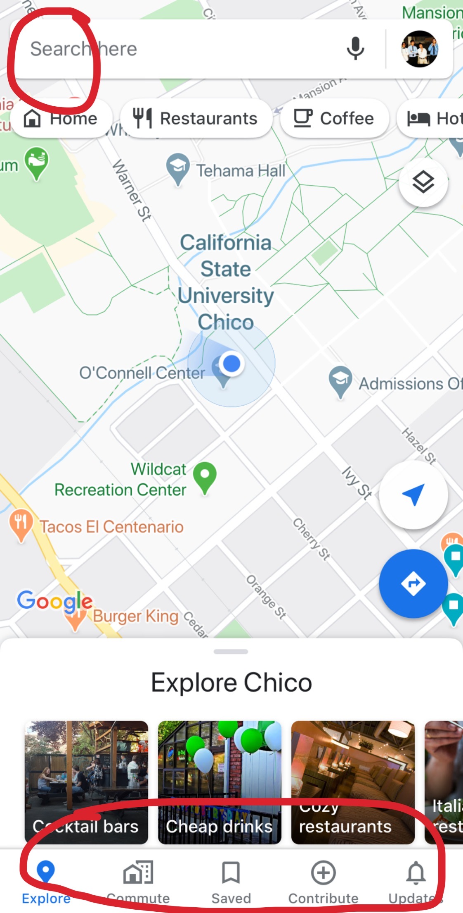
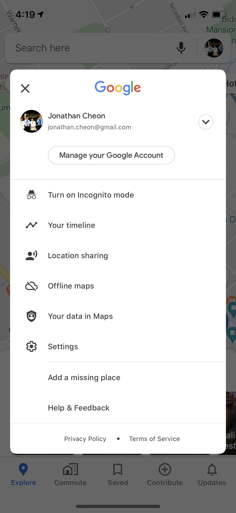
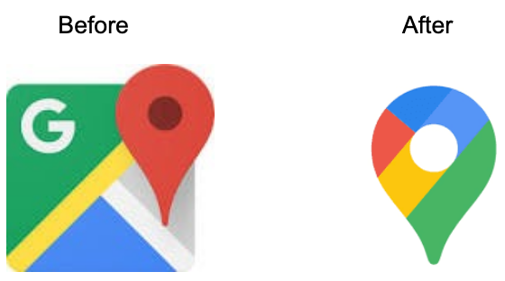

Google Maps UI/UX Recent Update
by Jonathan Cheon on 2/18/2020

Google Maps turned 15 years old a week ago. This accomplishment comes with awesome features and UX/UI changes that overall help users navigate the menu better. 

The first thing that I noticed is that the three horizontal bars (menu button) on the top left of the app is now gone! Where did it go? Usually I would tap on that to access my commute, saved places, contributions, and settings. Now that it's gone, I was helped by some tips that the app gave me. 

It told me that all of the menu items were now on the bottom and more settings are now avilable on the top right profile button. Loved how it gave me advice on how to better navigate the app since it got changed. I liked this touch very much. 

In addition to these changed, the Google Maps icon changed. Instead of the square block, it's now Google's signature color with just the ping. Since design is a language, I can easily tell that this is a Google product with the color scheme and design. I can easily learn that they have changed from one icon to another. 
