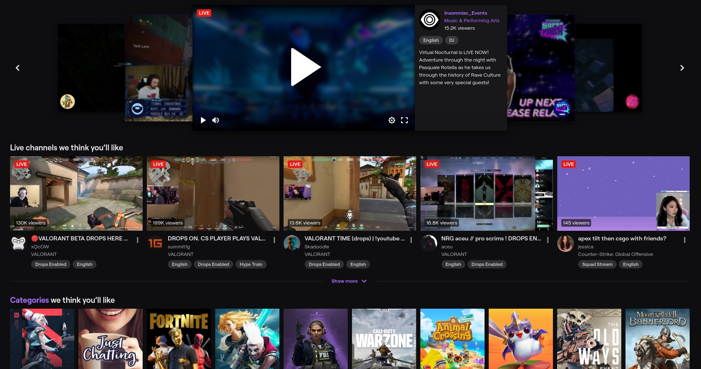
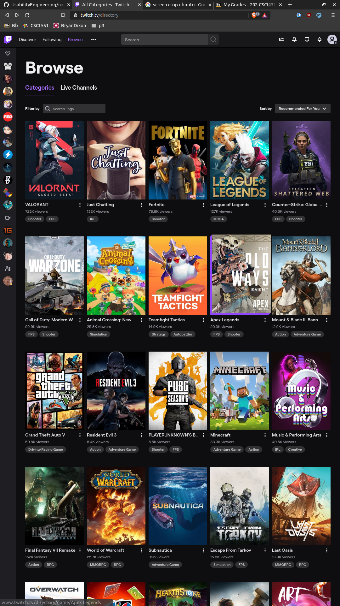
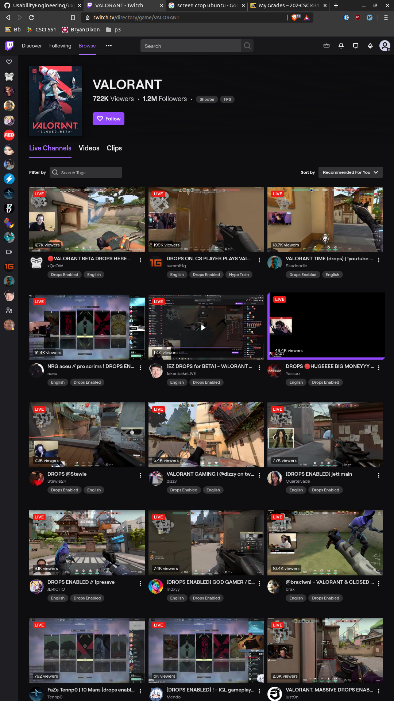

Twitch.tv recent updates
by Jonathan Cheon on 4/10/2020

Before I begin, I would like to spend some time about what Twitch is. Twitch is an amazing platform mainly for gamers stream their gameplay where users could join in to watch and chat with the commmunity. Over the years, Twitch has gained an increase in viewership and needed a better way to display streamers. This is where their recent update came. Instead of displaying game categories by highest viewers, they changed it by including a "Recommended For You".

When visiting Twitch, I am no longer introduced with streamers with a high viewership count, I am now introduced with streamers that I might like based on my activity on their website as shown below. 

When I first noticed this change, I didn't know that there was any change. All I noticed was that I enjoyed seeing all these new streamers that I could watch. This was a incredibably **useful** as I was getting a little tired of only watching the top streamers. Now, every time I visit Twitch, I'm able to see new streamers and get to join their community. 

This **useful** feature has made Twitch a place where new/fresh content could be seen every time a user visits the website. This slight change made it more addicting and fun to watch content on Twitch. 

Not only did Twitch make a **useful** change, but they also made it **learnable** by including this feature all throughout the website. Even when i'm in the 'Browse' tab to look for specific games I would like to watch, I am introduced with recommended games I might want to watch. 

As you can see, on the top right-hand side of the website, there is a 'sort by' option where users can sort by either 'recommended' or 'viewer count'. This option was not there before since the default was by viewer count. Now it is set to default to recommended and I enjoy it very much. I never had to scroll down to see what I wanted to watch, I wcould easily pick the ones from the top 10 given options since these choiced are 99% of the content that I watch anyways. 

At this point, I learned that this was the approach that Twitch has made. I could be safe as a user to assume that these will be thoughout the website and I was right. When you click on a game to see to see which streamers to watch, the streamers are also sorted by 'recommended' instead of viewership. This made it easily learnable since it was obvious that they made these changes and was consistent throughout the website. 